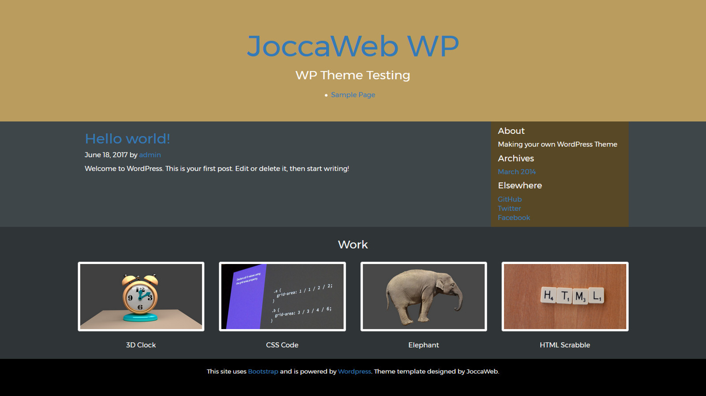

# WordPress Theme Template

This [WordPress](http://www.wordpress.org) Theme template uses [Bootstrap](http://getbootstrap.com) v3.3.7 and assumes intermediate knowledge of HTML, CSS and basic knowledge of PHP.

 

## Project Goal
This a wordpress theme from scratch. I converted a handmade HTML-CSS site to this theme. See the WordPress tutorial on [TaniaRascia.com](https://www.taniarascia.com/developing-a-wordpress-theme-from-scratch/). This tutorial offers a nice step by step explanation.
See also the [WordPress Codex](https://codex.wordpress.org/) for more information about WordPress theme development.

## Theme Structure
I have the index.php file calling header.php, footer.php, sidebar.php and content.php. 
Pages (non-blog entries) wil be auto-generated in content.php, see header.php. 
For having pages without the sidebar (and the blog entries with the sidebar), pages.php is added as a 2nd index. Single.php is a 3d index, for getting one post per page. 
You can add new php files if you want to have new sections in the layout of the site, but you have to put in code that that makes them custom template files. See [WP Theme Template Files]( https://codex.wordpress.org/Theme_Development#Template_Files_List).

## Installation
These are only the theme files, you'll have to set up a server with a Wordpress installation and then load and install this theme. See the credits for [Ampps](http://www.ampps.com/), a free and suitable server.
